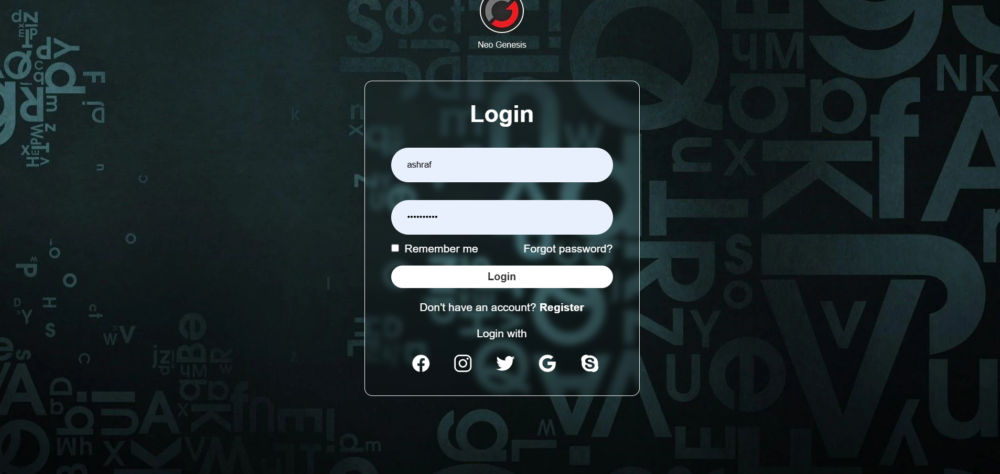
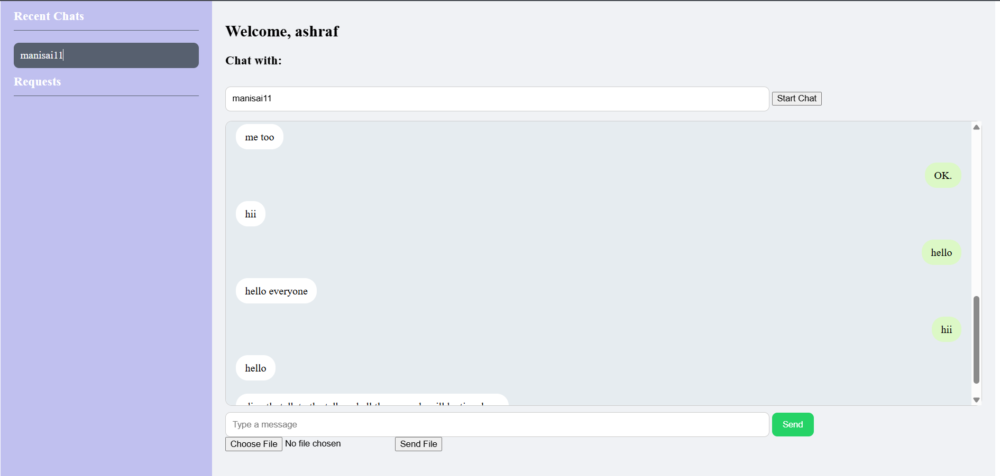

# 💬 ChatHub – Real-Time Chat Application


A full-stack, real-time chat application inspired by WhatsApp — featuring Google login, file sharing, and a sleek, responsive interface.


**Live Demo:** **[https://chathub-nco4.onrender.com/login](https://chathub-nco4.onrender.com/login)**







-----


### 🚀 About The Project


**ChatHub** was developed to bring real-time messaging into a clean, web-based environment with modern chat features. Whether it's for friendly conversations or academic use, this project demonstrates how core technologies like Flask, Node.js, and Socket.IO can be used to power seamless two-way communication.


It features secure Google login, a user-friendly chat interface, file sharing with smart previews, and persistent recent chat lists — all packaged in a responsive layout designed for desktop and mobile.


### ✨ Features


  * 🔐 **Google OAuth Login** – Secure sign-in via Google accounts.

  * ⚡ **Real-Time Messaging** – Instant message delivery using Socket.IO.

  * 📁 **File Sharing Support** – Send images (with previews) and documents (with download links).

  * 🕘 **Recent Chats Sidebar** – Smart tracking of recent users using `localStorage`.

  * 📱 **Responsive UI** – Optimized layout for desktop, tablet, and mobile.

  * 🧠 **WhatsApp-style Input Design** – Message box with integrated file input.

  * 🔄 **Cross-Device Sync** – Chat across multiple devices with real-time file transfer.


### 🛠️ Tech Stack


This project is built with both frontend and backend technologies:


  * **Frontend:** HTML5, CSS3, JavaScript (ES6+)

  * **Backend:** Flask (Python), Node.js

  * **Real-Time Engine:** Socket.IO

  * **Authentication:** Google OAuth 2.0

  * **Storage:** localStorage (on the frontend)


### ⚙️ Getting Started (Local Setup)


To get a local copy up and running, follow these steps.


#### Prerequisites


  * Python 3.8+ and pip

  * Git (for cloning the repository)

  * A modern browser (Chrome, Firefox, Edge)


#### Installation


1.  **Clone the repository:**


    ```bash

    git clone https://github.com/Ashrafpashamohammad/Chat_hub.git

    cd Chat_hub

    ```


2.  **Create a virtual environment:**


    For **Windows**:


    ```bash

    python -m venv venv

    venv\Scripts\activate

    ```


    For **macOS/Linux**:


    ```bash

    python3 -m venv venv

    source venv/bin/activate

    ```


3.  **Install Python dependencies:**


    ```bash

    pip install -r requirements.txt

    ```


4.  **Run the application:**


    ```bash

    python app.py

    ```


5.  **Open in your browser:**


    Visit [http://localhost:5000/login](http://localhost:5000/login)


### 🤝 Contact


GitHub – [@Ashrafpashamohammad](https://github.com/Ashrafpashamohammad)  

Project Link – [https://github.com/Ashrafpashamohammad/Chat_hub](https://github.com/Ashrafpashamohammad/Chat_hub)


---


⭐ *Star this repository if you find it useful or inspiring!*
